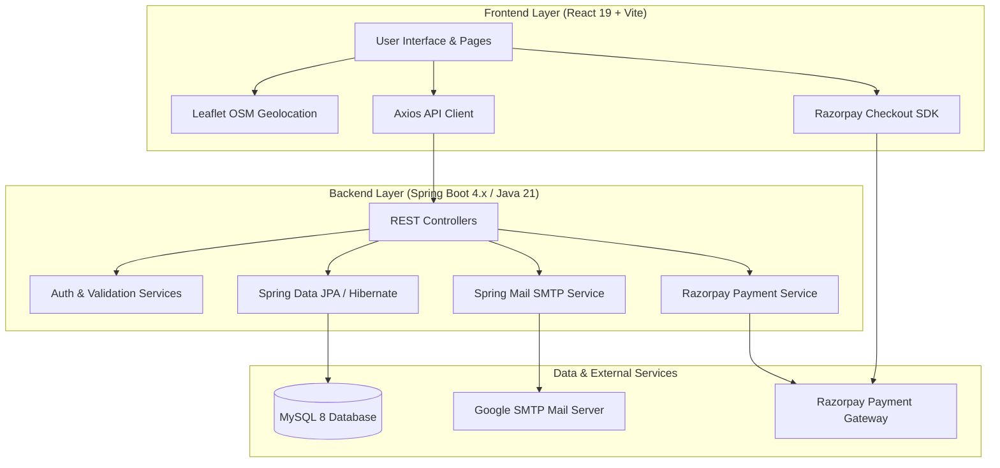

# 🚀 TechBridge — Full-Stack IT Hardware, Repair & Service Management Ecosystem

[](https://react.dev/)
[](https://vitejs.dev/)
[](https://spring.io/projects/spring-boot)
[](https://www.oracle.com/java/)
[](https://www.mysql.com/)
[](https://razorpay.com/)
[](https://leafletjs.com/)
[](LICENSE)

---

## 📌 Table of Contents
- [📖 Overview](#-overview)
- [🎯 Why TechBridge? (The Problem We Solve)](#-why-techbridge-the-problem-we-solve)
- [🌟 Aim and Mission](#-aim-and-mission)
- [🏗️ System Architecture](#️-system-architecture)
- [⚡ Core Features](#-core-features)
- [💻 Tech Stack & Languages](#-tech-stack--languages)
- [📂 Project Directory Structure](#-project-directory-structure)
- [🚀 Getting Started & Installation](#-getting-started--installation)
  - [Prerequisites](#prerequisites)
  - [1. Clone Repository](#1-clone-repository)
  - [2. Database Setup](#2-database-setup)
  - [3. Backend Setup (Spring Boot)](#3-backend-setup-spring-boot)
  - [4. Frontend Setup (React + Vite)](#4-frontend-setup-react--vite)
- [📡 API Endpoints Overview](#-api-endpoints-overview)
- [🌐 Live Deployment Guide](#-live-deployment-guide)
- [🔐 Security & Privacy Practices](#-security--privacy-practices)
- [🤝 Contributing & Support](#-contributing--support)

---

## 📖 Overview

**TechBridge** is an all-in-one, enterprise-grade full-stack web platform engineered to bridge the gap between consumers, computer hardware commerce, certified device repair services, and technical support. 

By combining an intuitive e-commerce shopping experience for PC components and IT accessories with an interactive map-based service center locator, online repair booking system, customer support ticketing engine, and real-time administrative intelligence dashboard, TechBridge redefines how users maintain, repair, and upgrade their technology.

---

## 🎯 Why TechBridge? (The Problem We Solve)

In today's digital landscape, computer and laptop owners face fragmented, unreliable, and non-transparent options when their devices malfunction or need upgrades:
1. **Scattered Repair Services**: Finding verified, authorized service centers nearby usually requires searching across multiple inaccurate directories.
2. **Disconnected Hardware Retail & Repairs**: Users buying replacement hardware parts often have no direct path to schedule installation or professional maintenance.
3. **Lack of Ticket Tracking**: Traditional repair shops communicate via phone calls or messaging apps, leading to lost receipts, unknown turnaround times, and lack of accountability.
4. **Opaque Pricing & Offline Payments**: Customers often face hidden fees or cash-only bottlenecks without instant order/receipt confirmation.

**TechBridge resolves all these issues by unifying hardware e-commerce, geolocation service center discovery, digital booking, transparent ticketing, and automated notifications into one synchronized ecosystem.**

---

## 🌟 Aim and Mission

- **Simplicity**: Deliver a seamless user experience for discovering products, booking doorstep or in-center repairs, and tracking service progress in real time.
- **Transparency**: Provide verified service center locations, clear itemized billing, and structured support ticket resolution.
- **Security & Reliability**: Safeguard user credentials with password hashing, email OTP validation for password resets, and trusted Razorpay checkout processing.
- **Operational Efficiency**: Empower administrators with actionable real-time analytics on revenue, service request pipelines, customer tickets, and inventory.

---

## 🏗️ System Architecture

TechBridge employs a decoupled, modern multi-tier architecture:



---

## ⚡ Core Features

### 🛒 1. Hardware & Component E-Commerce Store
- Complete catalog of computers, laptops, hardware components, and accessories.
- Search, filter by category, real-time price calculation, and stock status.
- Dedicated Wishlist and persistent Cart management.

### 📍 2. Interactive Service Center Locator
- Embedded Leaflet OpenStreetMap view of verified service centers across cities.
- Interactive custom markers detailing service center address, contact numbers, operating hours, and service specialties.
- Geolocation routing to guide users directly to their nearest authorized hub.

### 🛠️ 3. Service & Doorstep Repair Booking
- Request professional diagnostic and repair services directly from the web interface.
- Select preferred service types (Screen replacement, OS install, Chip-level motherboard repair, Thermal maintenance, Storage upgrade).
- View status updates from booking to delivery directly inside the user dashboard.

### 🎫 4. Support Ticketing System
- Integrated helpdesk allowing users to file support tickets for hardware queries or repair inquiries.
- Ticket status tracking (`OPEN`, `IN_PROGRESS`, `RESOLVED`, `CLOSED`) with admin response capability.

### 💳 5. Razorpay Online Payment Checkout
- Seamless integration with Razorpay Payment Gateway supporting UPI, Credit/Debit Cards, Net Banking, and Wallets.
- Resilient fallback transaction handlers ensuring smooth user experience even during test-mode simulations.

### 👤 6. Customer Dashboard & Account Settings
- Personalized overview of order history, service requests, and active support tickets.
- Profile management with password updates and email verification.

### 📊 7. Admin Business Intelligence Dashboard
- High-level metrics: Total revenue, active customer count, pending service requests, and open ticket status.
- Management tables to approve, update, and resolve customer service requests.
- Complete product inventory control (Add new products, update prices, delete items).

### 🔑 8. OTP-Verified Password Recovery
- Automated 6-digit one-time password (OTP) delivery powered by Spring Mail (JavaMailSender / SMTP).
- Secure OTP verification workflow to reset forgotten account credentials safely.

---

## 💻 Tech Stack & Languages

### **Frontend**
| Technology | Role |
|---|---|
| **JavaScript (ES6+) / JSX** | Core programming language for client logic |
| **React 19** | Component-driven declarative UI library |
| **Vite 8** | Next-generation lightning-fast frontend tooling and bundler |
| **React Router v7** | Client-side routing, navigation, and protected layouts |
| **Bootstrap 5 & Custom CSS3**| Responsive grid layouts, modern aesthetics, and polished styling |
| **Leaflet & React-Leaflet** | OpenStreetMap interactive mapping and custom geolocation pins |
| **Lucide React** | Sleek, modern SVG icon system |
| **Recharts** | Visual data analytics and chart representations |
| **Axios** | HTTP client for asynchronous REST API communication |

### **Backend**
| Technology | Role |
|---|---|
| **Java 21 (LTS)** | Core object-oriented programming language |
| **Spring Boot 4.x** | Enterprise web application framework |
| **Spring Data JPA / Hibernate** | Object-Relational Mapping (ORM) and dynamic SQL querying |
| **Spring Web / REST MVC** | Robust RESTful endpoints with JSON serialization |
| **Spring Mail (Jakarta Mail)** | Transactional email transmission for OTP and notifications |
| **Project Lombok** | Boilerplate code reducer (Getters, Setters, Builders, Constructors) |
| **Razorpay Java SDK** | Server-side payment order generation and cryptographic verification |
| **Maven** | Dependency management and build lifecycle automation |

### **Database & Infrastructure**
| Technology | Role |
|---|---|
| **MySQL 8.0+** | Relational database management system |
| **SMTP (Google Mail)** | Secure mail relay protocol for OTP delivery |
| **Razorpay API** | Payment processing gateway |

---

## 📂 Project Directory Structure

```text
TechBridge/
├── .gitignore                     # Global Git exclusion rules (secrets, target, node_modules)
├── README.md                      # Comprehensive project documentation
│
├── Backend/                       # Spring Boot Application (Java 21)
│   ├── mvnw / mvnw.cmd            # Maven wrapper executables
│   ├── pom.xml                    # Maven project configuration & dependencies
│   └── src/
│       ├── main/
│       │   ├── java/com/example/TechBridge/
│       │   │   ├── Controller/    # REST API Controllers (User, Products, Cart, ServiceCenter, etc.)
│       │   │   ├── Entity/        # JPA Database Entities (User, Products, ServiceRequest, etc.)
│       │   │   ├── Repo/          # Spring Data JPA Repositories
│       │   │   ├── Service/       # Business Logic Layer & Integrations (Email, Payment, Dashboard)
│       │   │   └── TechBridgeApplication.java  # Spring Boot Main Entry Point
│       │   └── resources/
│       │       ├── application.properties          # Config template (env variable placeholders)
│       │       └── application.properties.example  # Reference template for configuration
│       └── test/                  # Backend unit & integration test suites
│
└── techBridge/                    # React Frontend (Vite)
    ├── index.html                 # HTML5 entry document
    ├── package.json               # Frontend dependencies & npm scripts
    ├── vite.config.js             # Vite configuration
    ├── .env.example               # Frontend environment configuration template
    ├── public/                    # Static assets & SVG icons
    └── src/
        ├── App.jsx                # Route definitions & layout wrapper
        ├── main.jsx               # React DOM root render
        ├── assets/                # Banners, illustrations, and logos
        ├── Components/            # Reusable UI components (Header, Footer, ServiceCenterLocator)
        ├── config/                # Axios API base configuration
        ├── Css/                   # Modular stylesheets for every view
        ├── Pages/                 # Screen views (Home, About, Products, Cart, AdminDashboard, etc.)
        └── services/              # API caller services (wishlist, orders, tickets)
```

---

## 🚀 Getting Started & Installation

Follow these steps to run the complete full-stack platform on your local workstation.

### Prerequisites
Make sure you have the following installed:
- **Java Development Kit (JDK 21 or newer)**: `java -version`
- **Node.js (v18.0.0 or newer) & npm**: `node -v`
- **MySQL Server (8.0 or newer)**: Running locally on port `3306`
- **Git**: `git --version`

---

### 1. Clone Repository
```bash
git clone https://github.com/Builder-Tanmay/TechBridge-.git
cd TechBridge-
```

---

### 2. Database Setup
1. Launch MySQL CLI or MySQL Workbench:
```sql
CREATE DATABASE TechBridge;
```
2. Spring Data JPA Hibernate is configured with `ddl-auto=update`. Tables (`users`, `products`, `service_centers`, `cart`, `wishlist`, `service_requests`, `support_tickets`) will be automatically generated upon initial backend startup.

---

### 3. Backend Setup (Spring Boot)
1. Navigate to the backend directory:
   ```bash
   cd Backend
   ```
2. Configure your credentials:
   - Copy `src/main/resources/application.properties.example` to `src/main/resources/application.properties` (or edit `application.properties` directly).
   - Fill in your MySQL credentials and Gmail App Password:
     ```properties
     spring.datasource.url=jdbc:mysql://localhost:3306/TechBridge
     spring.datasource.username=root
     spring.datasource.password=YOUR_MYSQL_PASSWORD

     spring.mail.username=your_email@gmail.com
     spring.mail.password=YOUR_16_DIGIT_GMAIL_APP_PASSWORD

     razorpay.key.id=YOUR_RAZORPAY_KEY_ID
     razorpay.key.secret=YOUR_RAZORPAY_KEY_SECRET
     ```
   *(Alternatively, you can pass them as system environment variables `DB_PASSWORD`, `MAIL_USERNAME`, `MAIL_PASSWORD` without editing the file directly).*

3. Build and launch the Spring Boot service:
   - **On Windows**:
     ```powershell
     .\mvnw.cmd spring-boot:run
     ```
   - **On Linux / macOS**:
     ```bash
     ./mvnw spring-boot:run
     ```
4. Backend will start listening at: `http://localhost:8080`

---

### 4. Frontend Setup (React + Vite)
1. Open a new terminal tab and navigate to the frontend directory:
   ```bash
   cd techBridge
   ```
2. Install dependencies:
   ```bash
   npm install
   ```
3. *(Optional)* Configure API URL:
   - Copy `.env.example` to `.env`:
     ```env
     VITE_API_BASE_URL=http://localhost:8080
     ```
4. Start Vite development server:
   ```bash
   npm run dev
   ```
5. Open your browser and navigate to: `http://localhost:5173`

---

## 📡 API Endpoints Overview

| Category | Method | Endpoint | Description |
|---|---|---|---|
| **Auth** | `POST` | `/api/user/register` | Register new customer account |
| **Auth** | `POST` | `/api/user/login` | Authenticate customer credentials |
| **Auth** | `POST` | `/api/user/send-otp` | Generate & email OTP for password reset |
| **Auth** | `POST` | `/api/user/validate-otp` | Verify entered 6-digit OTP |
| **Auth** | `POST` | `/api/user/reset-password` | Reset password using verified email |
| **Auth** | `PUT` | `/api/user/change-password/{id}` | Update password from Account Settings |
| **Products** | `GET` | `/api/products` | Retrieve list of all catalog products |
| **Products** | `POST` | `/api/products` | Add new product (Admin) |
| **Products** | `DELETE` | `/api/products/{id}` | Remove product from inventory (Admin) |
| **Cart** | `GET` | `/api/cart/{userId}` | Fetch user cart items |
| **Cart** | `POST` | `/api/cart/add` | Add product to shopping cart |
| **Cart** | `DELETE` | `/api/cart/remove/{cartId}` | Remove item from cart |
| **Payment** | `GET` | `/createTransaction/{amount}` | Generate Razorpay order transaction |
| **Services** | `GET` | `/api/service-centers` | Fetch all service centers with GPS coords |
| **Tickets** | `POST` | `/api/tickets` | Submit customer support ticket |
| **Admin** | `GET` | `/api/admin/dashboard/stats` | Retrieve real-time sales & service analytics |

---

## 🌐 Live Deployment Guide

### Deploying the Frontend (Vercel / Netlify)
1. Push this repository to GitHub.
2. Sign in to [Vercel](https://vercel.com/) or [Netlify](https://www.netlify.com/).
3. Click **Add New Project** and import `TechBridge-`.
4. In Project Settings:
   - **Root Directory**: `techBridge`
   - **Build Command**: `npm run build`
   - **Output Directory**: `dist`
   - **Environment Variable**: `VITE_API_BASE_URL=https://your-backend-url.com`
5. Click **Deploy**. You will receive an active HTTPS live URL!

### Deploying the Backend (Render / Railway / AWS EC2)
1. In [Render](https://render.com/) or [Railway](https://railway.app/), create a new **Web Service**.
2. Connect your `TechBridge-` repository and specify:
   - **Root Directory**: `Backend`
   - **Build Command**: `./mvnw clean package -DskipTests`
   - **Start Command**: `java -jar target/TechBridge-0.0.1-SNAPSHOT.jar`
3. Add Environment Variables (`DB_HOST`, `DB_NAME`, `DB_USERNAME`, `DB_PASSWORD`, `MAIL_USERNAME`, `MAIL_PASSWORD`, `RAZORPAY_KEY_ID`, `RAZORPAY_KEY_SECRET`).
4. Attach a managed MySQL database instance.

---

## 🔐 Security & Privacy Practices

- **Zero Credential Leaks**: Never commit passwords, private keys, or API tokens. Use the provided `application.properties.example` and `.env.example` templates.
- **Git Ignore Protection**: The root `.gitignore` rigorously protects against accidental pushes of `.env`, `application-local.properties`, `target/`, and `node_modules/`.
- **OTP Verification**: Password resets require dynamic, time-limited 6-digit OTP verification sent directly to the registered email address.
- **Payment Verification**: Checkout payments are handled via Razorpay with encrypted order IDs and signature checks.

---

## 🤝 Contributing & Support

Contributions, feedback, and feature requests are welcome!

1. Fork the Project
2. Create your Feature Branch (`git checkout -b feature/AmazingFeature`)
3. Commit your Changes (`git commit -m 'Add some AmazingFeature'`)
4. Push to the Branch (`git push origin feature/AmazingFeature`)
5. Open a Pull Request

---

*Crafted with ❤️ by Tanmay Amte*
